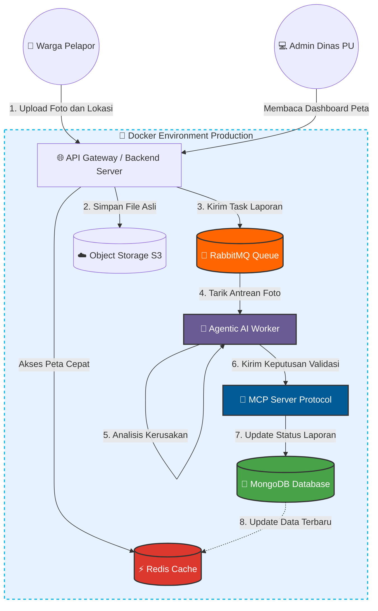

# 🏙️ SmartLapor (LaporJalan AI)

**Enterprise-Grade Public Facility Reporting System powered by Agentic AI, MCP, & Event-Driven Architecture.**


---

## 📌 Project Overview

Repository ini berisi rancangan **Infrastruktur dan Arsitektur Sistem** untuk "SmartLapor", sebuah solusi digital guna memecahkan masalah sistem pelaporan fasilitas publik (seperti jalan rusak) yang sering mengalami _server down_, lambat, dan kewalahan dalam proses verifikasi data.

Proyek ini disusun sebagai pemenuhan Tugas UTS Mata Kuliah **Topik Khusus** (Teknik Informatika / RPL).

## 🚀 Key Features & Solutions

1. **Asynchronous Upload (Zero-Downtime):** Mencegah server _timeout_ saat warga upload foto masal menggunakan **RabbitMQ**.
2. **Auto-Verification Agent:** Filtrasi laporan palsu dan penentuan prioritas secara otonom menggunakan **Agentic AI** yang terhubung via **Model Context Protocol (MCP)**.
3. **Ultra-Fast GeoMap:** Peta sebaran lokasi jalan rusak dimuat dalam waktu 0 milidetik berkat **Redis Cache** dan query Geospatial dari **MongoDB**.
4. **Ultimate Portability:** Seluruh infrastruktur di- _containerize_ menggunakan **Docker**, siap di-_deploy_ di server Pemda mana pun secara _On-Premise_.

---

## 🏗️ System Architecture

Diagram di bawah ini menggambarkan topologi _Event-Driven Microservices_ yang memisahkan proses _Read/Write_ dan mendelegasikan tugas berat ke _background worker_.



## 🛠️ Infrastructure as Code (How to Run)

Proyek ini mengadopsi prinsip _Infrastructure as Code_ (IaC). Anda dapat menjalankan seluruh ekosistem database dan message broker (_MongoDB, RabbitMQ, Redis_) secara lokal menggunakan Docker Compose.

1. Pastikan **Docker** dan **Docker Compose** sudah terinstal di sistem Anda.
2. Clone repository ini:
   ```bash
   git clone https://github.com/[USERNAME_GITHUB_ANDA]/SmartLapor-Architecture.git
   ```
3. Masuk ke direktori proyek dan jalankan _container_:
   ```bash
   cd SmartLapor-Architecture
   docker-compose up -d
   ```
4. Akses Dashboard RabbitMQ Management di browser: `http://localhost:15672`

---

## 🤖 Prompt Engineering Logbook

Pengembangan arsitektur ini didampingi oleh _Agentic AI_ sebagai _Technical Co-founder_. Sebanyak **60 prompt iteratif** telah dirancang mencakup fase Eksplorasi, Validasi Solusi, Analisis Kompetitor, dan Inovasi.

👉 **[Lihat Logbook 60 Prompt Lengkap di Sini](prompt-log.md)**

---

## 📂 Project Documentation

Dokumen lengkap terkait analisis bisnis, _Pitch Deck_, dan _Technical Whitepaper_ dapat diakses pada folder `/docs` di repository ini:

- [Technical Whitepaper (PDF)](docs/Technical_Whitepaper.pdf)
- [Executive Pitch Deck (PDF)](docs/Pitch_Deck.pdf)

---
